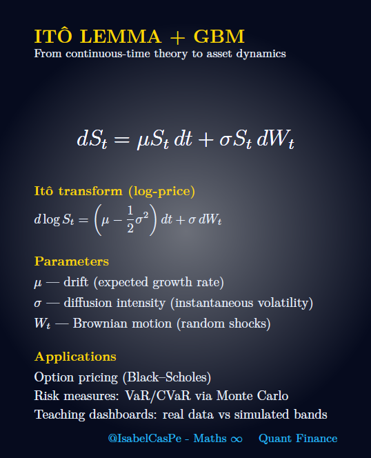
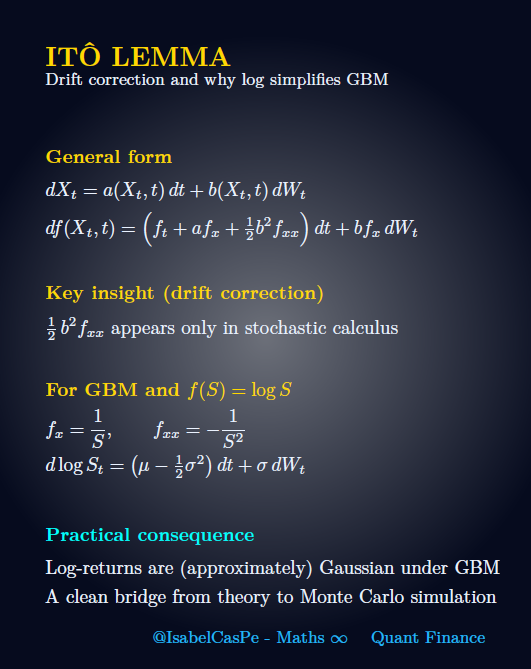
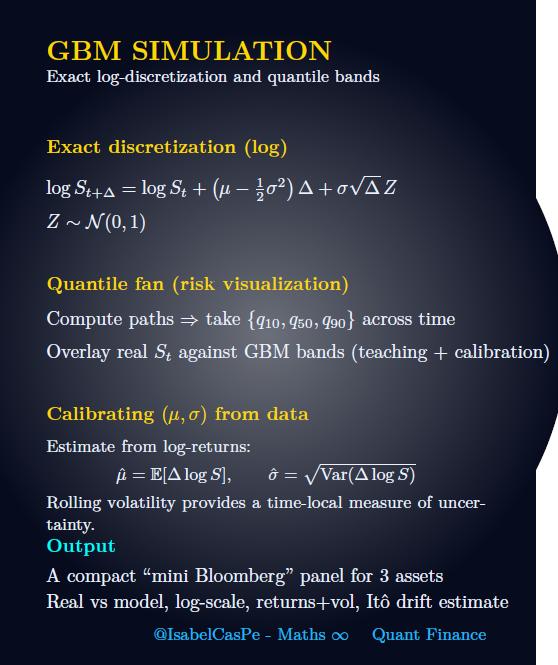
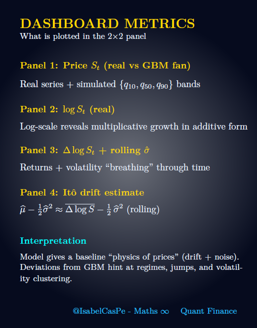
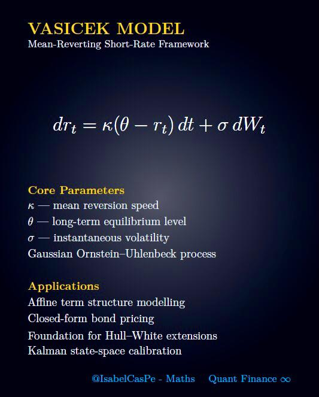
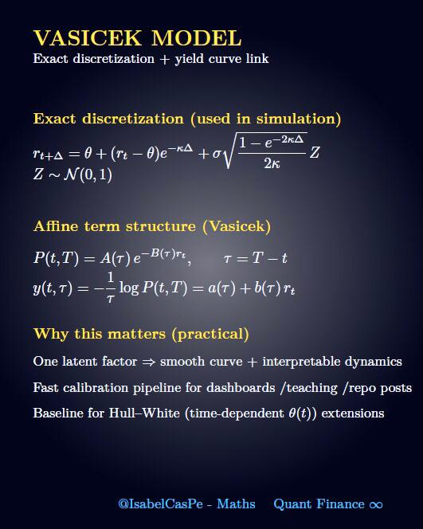

<!-- HERO -->
# Arte & Ciência em Movimento - Matemática Viva 💎 📈💹 ✨

 

**PT · EN · ES** · [Galeria](#galeria--gifs) · [Instalação](#instalação--installation--instalación) · [Apache License 2.0](#licença--license--licencia)

---

## Finance-Math 

Repositório com códigos e materiais para Matemática Financeira, focado em precificação de opções e análise de risco. Inclui uma implementação da fórmula Black-Scholes, alinhada com minha pesquisa de doutorado sobre modelos de contágio financeiro e medidas de risco (VaR, CVaR).

🌟 **Bem-vindo!** 🌟  
Desenvolvido por **Ana Isabel Castillo**, este repositório oferece recursos práticos para estudantes e profissionais de Finanças, Engenharia e Economia. Com 6 capítulos de slides, exemplos reais, gráficos e exercícios resolvidos, transforma conceitos complexos em decisões estratégicas. Explore o código Black-Scholes e mergulhe em um aprendizado que une teoria e prática!
## 🎯 Sobre o Curso
O **Finance-Math** é um material didático de excelência, projetado para ensinar desde os fundamentos até tópicos avançados de Matemática Financeira. Cada capítulo combina explicações claras, aplicações práticas (como financiamentos, investimentos e títulos) e exercícios que desafiam e inspiram. Perfeito para quem quer se destacar no mercado financeiro, na gestão de projetos ou na análise econômica.

### 📚 Esqueleto dos Capítulos
O curso é composto por **6 capítulos**, disponíveis em PDF:

- **[Capítulo 1: Juros Simples e Compostos](Cap1.pdf)**  
  Explore os fundamentos dos juros, com cálculos de rendimentos e aplicações em poupança e empréstimos.  
  *Ideal para: entender o crescimento do dinheiro ao longo do tempo.*

- **[Capítulo 2: Equivalência de Capitais](Cap2.pdf)**  
  Aprenda a comparar valores em diferentes momentos, essencial para planejamento financeiro.  
  *Ideal para: negociações e substituição de dívidas.*

- **[Capítulo 3: Análise de Fluxos de Caixa](Cap3.pdf)**  
  Domine a avaliação de fluxos financeiros, com técnicas para projetos e investimentos.  
  *Ideal para: engenheiros e economistas analisando viabilidade.*

- **[Capítulo 4: Séries de Pagamentos e Amortização](Cap4.pdf)**  
  Entenda anualidades, Tabela Price e SAC, com exemplos de financiamentos imobiliários.  
  *Ideal para: gerenciar dívidas e parcelamentos.*

- **[Capítulo 5: Análise de Investimentos](Cap5.pdf)**  
  Calcule VPL, TIR e Payback para avaliar projetos e tomar decisões estratégicas.  
  *Ideal para: finanças e engenharia de projetos.*

- **[Capítulo 6: Análise de Títulos](Cap6.pdf)**  
  Precifique títulos, calcule duration e analise a curva de juros, com foco em Tesouro Direto.  
  *Ideal para: investidores e analistas de mercado.*

## 🚀 Como Usar
- **Baixe os PDFs** dos capítulos acima para estudar offline.  
- **Acesse o curso online** no [site oficial](https://github.com/IsabelCasPe/Finance-Math-/) via GitHub Pages, com uma interface elegante e links diretos para cada capítulo.  
- **Explore o repositório** para atualizações e materiais extras.  

📢 **Nota:** Este material é destinado a uso educacional pessoal. Para uso comercial ou distribuição, entre em contato com a autora.

## 🔗 Outros Projetos
Gostou do **Finance-Math**? Confira também o repositório **[Controle Linear - Materiais Didáticos](https://github.com/IsabelCasPe/controle-linear-)**, com slides, exercícios e códigos em MATLAB/Python para sistemas de controle, com aplicações financeiras e de engenharia. Mais um projeto **Excepcional** da Prof. Ana Isabel Castillo!

## Arquivos Brabo 📈

- ****: Esfera Julia 4D quaterniônica modelando portfólios em colapso, com Lyapunov ~2.7 e pontos de Poincaré marcando defaults tipo GOLL4.SA. Caos sincronizado.
- **[resumodemathfinance1.pdf](resumodemathfinance1.pdf)**: Beamer “Sistemas Dinâmicos na Matemática Financeira”, com juros compostos, amortizações, GARCH, Black-Scholes, e caos brabo (Lyapunov 2.7). Base do *Math-Dynamics Lab*! 📊
---
##  📈 Relatório de Dividendos BBAS3 (2015-2025) 🌌

- [Banco do Brasil (BBAS3)](relatoriobb.pdf)
- **Elaborado por**: @IsabelCasPe  
- **Repositório**: [Finance-Math](https://github.com/IsabelCasPe/Finance-Math)  
- **Data**: 30 de Setembro de 2025

---
## Sobre o Projeto

- **O que é?**: Usamos sistemas dinâmicos (discretos e contínuos) pra modelar crises financeiras, volatilidade (mapa logístico) e riscos sistêmicos.
- **Destaques**:
  - Esfera Julia 4D: Portfólios caóticos, como GARCH explodindo.
  - Pontos de Poincaré: Defaults e picos de volatilidade.
  - Lyapunov (~2.7): Caos financeiro total, tipo crise de 2008 ou GOLL4.SA.
- **Inspiração**: A^2 (Artur Avila) 

## Como Usar

- Veja o GIF pra sentir o caos visual.
- Baixe o PDF pra mergulhar nos sistemas dinâmicos financeiros.
- Quer mais? Fica ligado no *Math-Dynamics Lab* e no caos que tá por vir! 

# Finance Math: Systemic Risk in Iran Crisis 2025

Welcome to the chaos, mano! 🌍 This project dives into the financial turbulence triggered by the Iran crisis (June 2025), where Trump's airstrikes on Fordo, Natanz, and Isfahan (21/06/2025) shook global markets. Using Monte Carlo simulations, *Value-at-Risk* (VaR), and *Conditional Value-at-Risk* (CVaR), we model *Systemic Risk* amplified by fuel inflation and geopolitical shocks. Built with 💖 by Ana Isabel C. 
## Project Overview

The Iran crisis, with its threat to the Strait of Hormuz (33% of global oil), spikes oil prices, fuels inflation, and risks financial contagion. This project:
- Simulates 10 scenarios (S1-S10) with a Monte Carlo model, capturing a crisis shock (0.05, prob. 0.3) and perturbation (\( 0.02 \cos(t/5) \)).
- Analyzes escalation scenarios (pessimistic, realistic, optimistic) and their impact on *Systemic Risk*.
- Highlights fuel inflation as a key driver of global economic chaos.

Inspired by *GeoChaosDynamics* 
## Contents

- **`systemic_risk_iran_crisis_v20.mp4`**: [Systemic Risk in Chaos: Iran Crisis 2025](systemic_risk_iran_crisis_v20.mp4)
  - **Description**: A Monte Carlo animation visualizing *Systemic Risk* in the Iran crisis. Shows 10 scenarios (S1-S10), VaR (95%, neonpink dashed line), and CVaR (95%, text). Includes a fuel price shock (0.05, prob. 0.3) and perturbation (\( 0.02 \cos(t/5) \)). Credits and watermark: “© Ana Isabel C. Finance Math”.
 
- **`analisedeatualidade.pdf`**:  [Systemic Risk in Chaos: Iran Crisis 2025](analisedeatualidade.pdf)
  - **Description**: A Beamer presentation analyzing the Iran crisis (June 2025). Covers:
    - Current chaos: Trump’s airstrikes and market impacts.
    - Escalation scenarios: Pessimistic (oil +$30/barrel), realistic (+$10/barrel), optimistic (stable).
    - Fuel inflation: Role of the Strait of Hormuz in *Systemic Risk*.
    - Modeling: Monte Carlo with VaR/CVaR, linked to `v20.mp4`.
  - **Usage**: Open with a PDF viewer. Perfect for QFE or classroom chaos (22/06/2025).

## Usage

- **Video (`v20.mp4`)**:
  - Play with any media player (ex.: VLC).
 
- **Presentation (`analisedeatualidade.pdf`)**

## License

Creative Commons Attribution-NonCommercial-NoDerivatives 4.0 International Apache License 2.0  
Copyright © 2025 Ana Isabel C. 
*“Trump x Irã tá um caos, mas S1-S10 e CVaR brilham no Finance Math!”*  
© Ana Isabel C.  22/06/2025

## 📖 Convite para Estudar
Seja você um estudante sonhando com uma carreira de sucesso, um engenheiro planejando projetos inovadores ou um economista decifrando mercados, o **Finance-Math** é o seu guia para transformar números em oportunidades. Mergulhe nos capítulos, resolva os exercícios e construa um futuro financeiro sólido! **Que tal começar agora?**

##  Agradecimento
Um **obrigado especial** a todos que acompanham e valorizam este projeto! Como professora apaixonada por ensinar, meu maior desejo é que o **Finance-Math** inspire e empodere você na sua jornada acadêmica e profissional. Agradeço de coração pelo seu interesse e confiança. Vamos juntos fazer a diferença!  
— **Prof. Ana Isabel Castillo**

## 🎬 Dynamic Simulation :  Ito Lemma GBM Quant Finance 

- 
  
- 
  
- 
  
- 

The full animated Ito's Lemma simulation  
is available on Instagram:

👉 [Watch the dynamic version here](https://www.instagram.com/isabel_maths/)  
  
## 🎬 Dynamic Simulation (Bloomberg-style dashboard)

- 
  
- 
  
-  
  
- 

The full animated Vasicek + Kalman filtering simulation  
is available on Instagram:

👉 [Watch the dynamic version here](https://www.instagram.com/isabel_maths/)

##  Planos Futuros
- Adicionar um caderno de exercícios interativos com resoluções detalhadas.  
- Incluir simulações financeiras em Python/R para VPL, TIR e precificação de títulos.  
- Criar vídeos explicativos para cada capítulo, com exemplos práticos.

  ## 📚 Referências Bibliográficas
Este curso foi desenvolvido com base em referências consagradas em Matemática Financeira e Finanças Corporativas, garantindo rigor acadêmico e aplicabilidade prática:

- ROSS, S. A.; WESTERFIELD, R. W.; JAFFE, J. *Administração financeira*. 10. ed. Porto Alegre: Bookman, 2013.
- NETO, A. A. *Matemática financeira e suas aplicações*. 14. ed. São Paulo: Atlas, 2018.

## 📜 Licença
Este projeto está licenciado sob a [Apache License 2.0](LICENSE). No entanto, os PDFs são materiais educacionais destinados exclusivamente a uso pessoal e acadêmico. Uso comercial ou distribuição requer autorização expressa da autora, Prof. Ana Isabel Castillo.

## 📬 Contato
- **Autora:** Prof. Ana Isabel Castillo   
- **Email:** [anacp20@gmail.com](mailto:anacp20@gmail.com)  
- **GitHub:** [@IsabelCasPe](https://github.com/IsabelCasPe)  
- **Site:** [isabelcaspe.github.io](https://isabelcaspe.github.io/)  
- **Repositório:** [github.com/IsabelCasPe/Finance-Math](https://github.com/IsabelCasPe/Finance-Math-)

⭐ **Gostou do curso? Deixe uma estrela no repositório e compartilhe com quem precisa!** ⭐

## Inspiration.

> "Nas equações do mercado, o caos financeiro dança com a ordem quântica  @FinanceMaths, onde a ciência guia e o risco se rende à análise." 📈 💙
> Copyright © 2025 Prof. Ana Isabel C.
---
